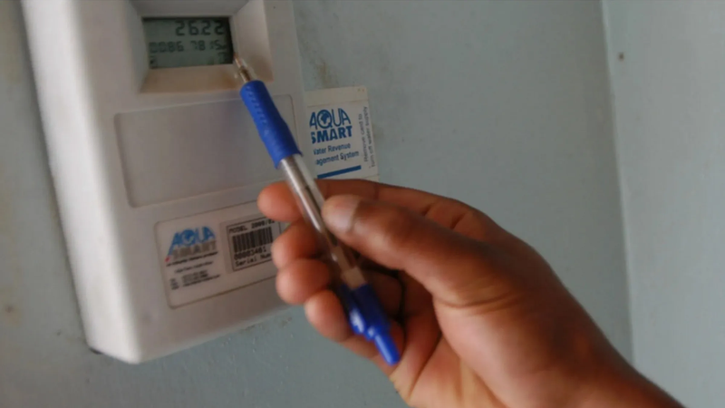
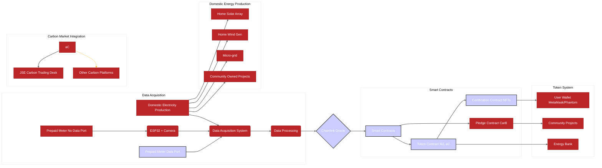

# Community Carbon Credits and Blockchain Energy System

This project integrates a carbon credit system with an energy token system.  The core contracts are detailed in [docs/README.md](docs/README.md), including `carboncredits.sol`, `credittoken.sol`, `certification.sol`, `token.sol`, `integration/IntegrationContract.sol`, and `pledge.sol`.  A key feature of this system is the issuance of carbon credits (aC) as NFTs, providing enhanced security and transparency.

# Rationale

Currently City of Cape Town (CoCT) electricity users may feed electricity into the grid in exchange for a modest credit on the network. This is all good and well, but it creates a vertical monopoly where consumers who produce i.e. *prosumers* are prevented from sharing energy and/or surplus credits directly with their neighbours and the community at large. In addition, only feed-in energy is rewarded. 

We propose the addition of a blockchain token (mJ) which is minted whenever there is "proof of production" of one watt of domestic energy, the mJ can then be traded for a carbon credit (aC) via an API to the JSE carbon trading desk, Cape Town Stock Exchange or other carbon trading projects.

Benefits include reward of domestic electricity production irrespective of the feed-in tariff, and ability to pledge and store tokens for future economic advantage. 

Read our [white paper](https://github.com/Muizenberg-Electricity-Cooperative/Carbon-Project/blob/main/docs/white-paper.md) if you want to understand how we got to this point.

We are collecting images of prepaid meter installations If you have a prepaid meter, please send us a photo of it.


## Project Structure

* **`carboncredits.sol`:** Core contract for managing carbon credit holders, verifiers, and customers.
* **`credittoken.sol`:** ERC20 token contract for carbon credits, inheriting from `carboncredits.sol`.
* **`certification.sol`:** Contract for a specific certification standard (e.g., Gold Standard), inheriting from `credittoken.sol`.
* **`integration/IntegrationContract.sol`:** Contract integrating the carbon credit system with the energy token system.
* **`token.sol`:** Contract for energy (mJ) and carbon credit (aC) tokens.  This contract now supports the issuance of aC tokens as NFTs.
* **`pledge.sol`:** Contract for pledging mJ and/or aC tokens to generate CarB tokens.
* **`docs/README.md`:** Detailed documentation for all contracts.
* **`docs/chainlink_integration.md`:** Documentation for Chainlink oracle integration.
* **`docs/system_diagram.md`:** Mermaid diagram visualizing the contract system.
* **`docs/electricity_meter_data_spec.md`:** Specification for electricity meter data output port.
* **`docs/white-paper.md`:** MECC White Paper
* **`docs/prepaid_meter_data_acquisition.md`:** Documentation for data acquisition from prepaid meters.
* **`docs/esp32_data_acquisition_diagram.md`:** Mermaid diagram visualizing the ESP32 data acquisition system.
* **`esp32_firmware/main.cpp`:** ESP32 firmware for data acquisition.
* **`open-meter/README.md`:** Open-meter project for electricity meter data acquisition.
* **`open-meter/main.cpp`:** ESP32 firmware for data acquisition.

## Integration Details

The `IntegrationContract.sol` facilitates the interaction between the carbon credit system and the energy token system.  It allows for the accrual of aC tokens based on carbon credit issuance and potentially mJ token usage (requires further implementation).  

A `Chainlink oracle` is planned for verifying energy usage data and minting mJ tokens.

A `Data Output Port specification` ([docs/electricity_meter_data_spec.md](docs/electricity_meter_data_spec.md)) is proposed to facilitate data acquisition for the Chainlink oracle in terms of future public policy.

A [method of scraping data from the current metering system](docs/prepaid_meter_data_acquisition.md) utilising ESP32 & MPEG is proposed given the current state of the prepaid metering system.

An independent DIY `open-meter` PCB project is proposed to facilitate data acquisition from home solar arrays. The gerbers have yet to be generated.

## Polygon Network Refactoring

Refactoring this project to the Polygon network involved recompiling the [contracts for the Polygon network](polygon-contracts/) and will require deployment to a Polygon-compatible RPC endpoint.  Key considerations include:

* **Gas Costs:**  Gas costs on Polygon are generally lower than on Ethereum, potentially reducing transaction fees.
* **Network Compatibility:** Ensure compatibility with Polygon-specific tools and libraries.
* **Bridge Considerations:**  If any existing contracts are deployed on Ethereum, a bridge mechanism might be needed to transfer tokens or data between networks.  Since this project is not yet deployed, this is not a current concern.
* **Testing:**  Ensure that tests are compatible with Polygon's environment.
* **Polygon is Carbon Neutral:** Polygon is carbon neutral, which is a significant consideration for projects aiming to be environmentally conscious.

## Diagram of our System
You can view a [mermaid diagram of our system here](docs/benefit_loop_diagram.md), alongside other diagrams in our [schematics folder](docs/schematics/).



## Future Work

* Implement the Chainlink oracle integration.
* Implement the carbon credit gateway API.
* Further define the relationship between mJ and aC token accrual.
* Thorough testing and modeling to assess viability.
* Further define pledge system.
* Implementation of an 'honest-broker' verification system.
* Explore autobidding & time-of-use windows.
* Implementing aC as a governance token within a DAO. 
* Outline how holders of aC NFTs will possess right to vote on DAO decisions.

## Getting Started

To get started with the project, follow these steps:

1. Clone the repository:
   ```bash
   git clone https://github.com/umbane/carbon-project.git
   ```
2. Navigate to the project directory:
   ```bash
   cd carbon-project
   ```
3. Explore the project structure and documentation.

## Contributing

We welcome contributions to the project. Please follow these guidelines:

1. Fork the repository.
2. Create a new branch for your feature or bug fix.
3. Make your changes and commit them with descriptive commit messages.
4. Push your branch to your fork.
5. Create a pull request to the main repository.
