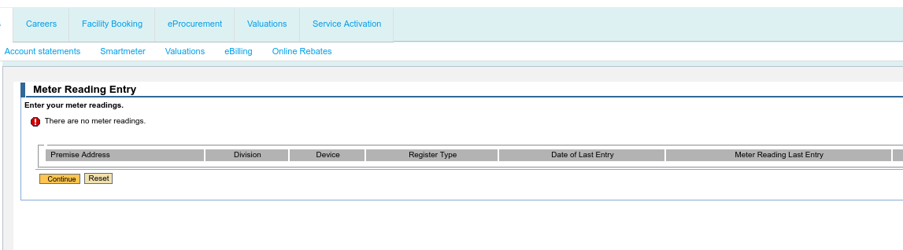

# Alternative Data Acquisition Methods: City of Cape Town eServices Hub

This document outlines alternative methods for acquiring electricity meter reading data from the City of Cape Town's eServices hub (https://eservices.capetown.gov.za/irj/portal), given the current limitations of the "Meter Reading Entry" section and the lack of a functional CSV download for electricity meter readings.

## Current Limitations

The City of Cape Town's eServices hub currently lacks a fully implemented system for electricity meter reading data acquisition.  The "Meter Reading Entry" section allows manual entry of readings, but automated data extraction is not possible.  A CSV download feature is also absent.  Only the water service, refuse collection and municipal contract CSVs appear to be available, but they are not populated with data, and thus are not suitable for data extraction.

## Alternative Methods

Several alternative methods can be explored to acquire the necessary data:

### 1. Manual Data Entry

While not ideal for automation, manual data entry remains a viable option.  This involves regularly accessing the "Meter Reading Entry" section and manually inputting the meter readings into the system.  This method is time-consuming and prone to errors.

### 2. Web Scraping

Web scraping could be used to extract data from the "Meter Reading Entry" section, provided the website's structure remains consistent.  This would require developing a script (e.g., using Python's `Beautiful Soup` or `Scrapy` libraries) to parse the webpage and extract the relevant data.  However, this approach is dependent on the website's structure and may break if the website is redesigned.  It's also important to respect the website's `robots.txt` and terms of service.

### 3. API Integration (Future Enhancement)

The most efficient solution would be to request the City of Cape Town to implement an API for data access.  An API would allow for seamless integration with other systems, such as Home Assistant, enabling automated data retrieval and analysis.  This would require collaboration with the City's IT department to design and implement a suitable API.

## Recommendation

We strongly recommend advocating for the implementation of an API for electricity meter reading data access.  This would provide a robust and efficient solution for automated data acquisition, eliminating the need for manual data entry or potentially unreliable web scraping techniques.  In the interim, manual data entry can be used, while exploring the feasibility of web scraping as a temporary solution.

## Advocacy for System Improvement

We should actively engage with the City of Cape Town to emphasize the importance of implementing a fully functional data acquisition system.  This could involve:

* Submitting formal requests to the City's IT department.
* Highlighting the benefits of an API for both the City and its citizens.
* Providing technical assistance in designing and implementing the API.

By advocating for system improvements, we can ensure a more efficient and reliable method for accessing electricity meter reading data.
